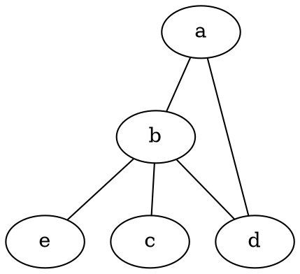
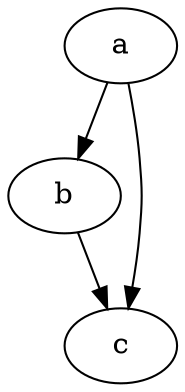
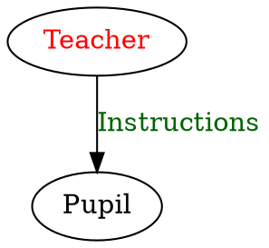
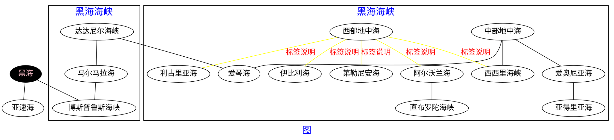

# Graphviz的安装以及基本使用

## 介绍
Graphviz可通过代码的方式生成图形

## 安装
win下，可在官网[http://http://www.graphviz.org/Download_windows.php](http://http://www.graphviz.org/Download_windows.php)下载，安装好后，手动将bin文件夹添加到环境变量即可。
cmd 下键入`dot -version`,能出现Graphviz相关信息，则表示安装成功

## 生成图片
```
dot 源文件 -T 图片格式 -o 输出文件
dot input.dot -T png -o output.png
```
可利用sublimeText的编译系统，实现图片实时预览
> 具体可参考这篇文章
[https://zhuanlan.zhihu.com/p/22820399](https://zhuanlan.zhihu.com/p/22820399)

新建`*.dot`文件，然后编写相应代码，再编译就能生成图

## 基本语法
```
图类型 图名{
    //其他
}
```

### 无向图


### 有向图


### 定义一类节点


### 设置属性(样式)

最终生成的


### 中文乱码
保证.dot文件是以UTF-8编码
通过设置fontname为中文字体来解决

### 参考链接
> https://zhuanlan.zhihu.com/p/21993254
> https://zhuanlan.zhihu.com/p/22820399
> http://blog.csdn.net/xiajian2010/article/details/23748557
> http://www.tuicool.com/articles/vy2Ajyu